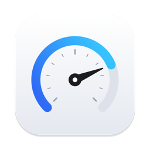

<p align="center">
  
</p>

<h1 align="center">CopySpeed</h1>

<p align="center">
  Zeigt beim Kopieren im Finder die <b>aktuelle Übertragungsgeschwidigkeit</b> direkt am Kopierfenster an –
  in MB/s und Mbit/s, pro Vorgang und als Summe.
</p>

---

Das Kopierfenster von macOS zeigt nur die verbleibende Zeit, aber nie, wie schnell gerade kopiert wird.
CopySpeed dockt eine kleine Anzeige unter das Kopierfenster an:

- **Aktuelle Geschwindigkeit** (über 3 s geglättet) und **Durchschnitt** pro Kopiervorgang
- **Gesamtsumme**, wenn mehrere Kopien gleichzeitig laufen
- Einheit wählbar: **MB/s**, **Mbit/s** oder beides
- Optional die Gesamtgeschwindigkeit live in der **Menüleiste**
- Funktioniert mit Netzlaufwerken (SMB), externen Platten und lokalen Kopien
- Sprachunabhängig (erkennt das Kopierfenster über seine Accessibility-Kennung)

## Installation

1. `CopySpeed-x.y.z.dmg` aus den [Releases](../../releases) laden und CopySpeed in „Programme“ ziehen.
2. CopySpeed starten. macOS fragt nach dem **Bedienungshilfen-Zugriff** – erlauben
   (Systemeinstellungen → Datenschutz & Sicherheit → Bedienungshilfen).
3. Fertig. Beim nächsten Kopieren erscheint die Anzeige unter dem Kopierfenster.

> **Hinweis:** Die aktuellen Builds sind noch nicht mit einer Developer ID notarisiert. Beim ersten Start
> meldet macOS deshalb, dass die App nicht überprüft werden kann. Dann in
> *Systemeinstellungen → Datenschutz & Sicherheit* auf **„Trotzdem öffnen“** klicken.

**Voraussetzung:** macOS 14 Sonoma oder neuer (entwickelt und getestet unter macOS 27).

## Wie es funktioniert

CopySpeed liest das Finder-Kopierfenster (`AXWindow`, Kennung `Progress`) alle 0,5 s über die
Accessibility-API aus. Pro Vorgang werden Titel, Fortschrittsbalken (0…1) und Statustext
(„2,00 GB von 3,74 GB …“) gelesen. Übertragene Bytes = Balkenwert × Gesamtgröße; daraus ergibt sich die
Geschwindigkeit. Die Anzeige ist ein rahmenloses `NSPanel`, das direkt über dem Kopierfenster einsortiert
wird und Klicks durchlässt.

Es werden keine Daten gesammelt oder übertragen, und CopySpeed greift nicht auf Dateiinhalte zu.

## Selbst bauen

```bash
brew install xcodegen
xcodegen generate
xcodebuild -project CopySpeed.xcodeproj -scheme CopySpeed build
```

Tests: `xcodebuild -project CopySpeed.xcodeproj -scheme CopySpeed test`

Für die Fehlersuche lassen sich Rohdaten mitschreiben:
`defaults write com.roman.copyspeed debugLog -bool YES` → `~/Library/Logs/CopySpeed/debug.log`

## Projektstruktur

| Pfad | Inhalt |
|---|---|
| `CopySpeed/Accessibility` | Auslesen des Finder-Kopierfensters |
| `CopySpeed/Core` | Parser, Geschwindigkeitsberechnung, Formatierung |
| `CopySpeed/Overlay` | Anzeige am Kopierfenster |
| `CopySpeed/App` | App-Einstieg und Menüleiste |
| `Design` | App-Icon als SVG (hell/dunkel) |
| `Spikes` | Machbarkeitstests aus der Entwicklung |
| `TODO.md` | Plan, Erkenntnisse und offene Punkte |

## Lizenz

[MIT](LICENSE) © 2026 Roman Hohenberg
